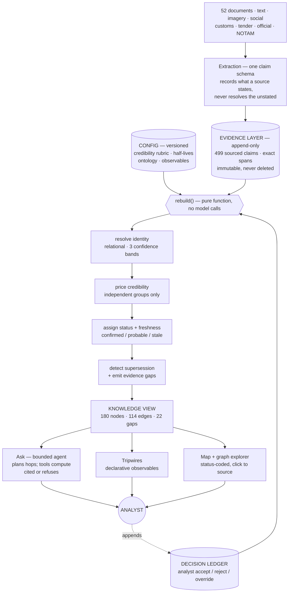

# Chanakya — an auditable OSINT order-of-battle and supply-chain map

**Design note · HQ-9/P (Pakistan) · July 2026**

## What this is

Open sources are abundant, cheap to fabricate, trivially recycled, and produced almost entirely by
parties with an interest in the answer. The scarce thing is not collection; it is warranted belief. This
system is built around that.

It assembles a fragmented open-source picture into **one auditable order-of-battle plus supply chain for
a single adversary air-defence capability** — what they have, where it is, how it is sustained, and where
the dependencies break. The subject is the Pakistani HQ-9/P long-range SAM, enriched with the Chinese
HQ-9 origin chain. Open sources only, planning awareness rather than targeting-grade, and an analyst in
the loop — never finished intelligence emitted autonomously.

The build is **one reusable spine plus a thin use-case layer**. The spine — the claim model, entity
resolution, credibility, human adjudication, freshness, retrieval — is subject-agnostic and took most of
the engineering; the HQ-9/P layer is a specification on top of it. The current graph is built from **499
sourced claims extracted from 52 documents** (25 carrying signal, 27 deliberate chaff, 12 of them
imagery), yielding a knowledge view of 180 nodes, 114 edges and 22 named evidence gaps.

## Four load-bearing ideas

**1. A bi-level graph.** The lower layer is an **append-only evidence layer**: immutable sourced claims of
the form *source S, dated D, asserts that X relates to Y*, each pinned to an exact span in an exact
document, never edited and never deleted. The upper layer is a **knowledge graph derived from it by a
pure function** — resolve entities, price credibility, assign status, recompute. Because the derived
layer is a function of the log, one-click traceability and the separation of *confirmed* from *probable*
are properties of the architecture rather than features bolted onto it: every node and edge carries the
claim identifiers that produced it, so "why does this exist" always answers with spans, not a summary. It
also makes a human decision, a retraction and a new document the same operation — append, then recompute.

**2. Credibility, not collection.** A claim's confidence is built from the reliability grade of its
originating source, the number of genuinely **independent** corroborating groups, integrity signals, and
freshness decay. Independence is the discriminating idea: two reshares of one photograph are one look,
not two. Groups are keyed by collection discipline, originating document and source interest, so
satellite imagery plus a separate textual report is two looks while a coordinated social cluster is one.
A single look, however plausible, does not reach *confirmed*; a deception-flagged one is capped lower
still. We rejected treating deception as a multiplier on the score: anything that multiplies can be
averaged back up by enough weak corroboration, which is exactly the outcome a deception operation is
designed to produce. It caps instead.

**3. Human-in-the-loop as attention triage.** One adjudication service any pipeline stage can call, not
per-stage review code. Confident judgements proceed; ambiguous or high-stakes ones queue with a readable
reason. Crucially, an analyst decision **mutates graph state** — a rejected merge stays rejected on the
next rebuild and the downstream answer changes with it. Triage is recall-biased on purpose: the default
outcome of a contested supersession is a queued candidate, not an automatic action.

**4. Adaptation.** Perishable facts decay — a basing position sits on a garrison half-life of 540 days,
while a manufacturing relationship does not decay at all — and coverage gaps are first-class objects with
a next-coverage-due date. This is what makes the system a monitor rather than a one-shot analysis:
judgement stays honest as sources close and as the picture ages underneath it.

## From document to claim to graph

**Ingestion is source-typed, never subject-typed**, and nothing is filtered at the door. A front company
exists precisely so its filings do not mention the system it is importing; a dual-use HS code is chosen
precisely because it looks like radar parts for anyone. Screening on "mentions the subject" at ingest
would delete the evidence the investigation exists to find, so relevance is a conclusion reached late —
typed at extraction, scored by proximity at query time, weighted by credibility at assessment. Extraction
records what a source *states*, including an alias it explicitly asserts, but never resolves what it
leaves unstated: it does not quietly collapse a front company into its parent. The pipeline has to earn
its resolutions, or it is grading its own homework.

**The schema is designed; the instances are discovered.** Entity and edge types are hand-authored —
manufacturer, component supplier, variant, radar, fire unit, formation, basing site, port, import event,
and *known gap* as a first-class node; edges for *manufactures*, *supplies-component*, *variant-of*,
*imported-by*, *based-at*, *substitutable-by*, plus the resolution overlays *same-as* and *distinct-from*.
Instances come from sources; a genuinely new type is proposed to an analyst rather than invented by a
model. And because a claim knows nothing about who will ask, **a subject is a query-time lens, not a
partition** — anchor entities plus a traversal pattern over one graph, which is why a second subject is
configuration rather than a second system.

**Resolution is the analytic engine, not a cleanup step.** If relevance only emerges once the unlabelled
importer is connected to the subject, then whatever makes that connection is doing the analysis — and
string similarity cannot. Identity here is relational: designators touching the same units, sites and
suppliers are probably the same thing whatever their spelling, while two that look nearly identical may
be unrelated systems. So shared neighbourhood carries the most weight, alongside attribute similarity,
temporal consistency and explicit source assertions, and the result lands in one of three bands — merge,
adjudicate, keep apart. The band boundary is set precision-first because the errors are asymmetric: a
missed merge is recoverable by iteration or a human, while a confident wrong merge corrupts the
order-of-battle invisibly. FD-2000 against the unrelated FT-2000 belongs in a queue. Every merge is a
reversible overlay rather than a destructive collapse, so an analyst can undo the machine's identity
decisions — which is the difference between a human in the loop and a human watching.

**Retrieval separates composing an answer from judging it.** A question runs a bounded think-act-observe  
loop in which the model plans the traversal while deterministic tools do the counting, path-finding and  
materiality; the model never tallies chokepoints in its own head. Citations are validated, and an empty  
result routes to a reasoned evidence gap based refusal rather than a confident negative. We considered and rejected three  
alternatives: GraphRAG-style community summarisation, because routing answers through a generated summary  
severs the line back to the exact span; single-pass vector retrieval, because it cannot chain battery to  
operator to supplier and its chunk-level provenance cannot separate *says* from *corroborates*; and
free-form query generation, because it cannot distinguish "no data" from "insufficient to assess" — the
one distinction this system exists to make.

## The non-negotiable, mechanised

Where evidence is absent, ambiguous, or contradictory the system returns **"insufficient evidence to
assess"** — and names what is missing. This is not prompt discipline; it is an **evidence-requirement
template** attached to the assertion type. Confirming a sole-source supplier requires a named supplier and
a substitutability assessment; confirming a basing position requires imagery plus an independent textual
group. When the slots are unfilled the system emits a gap object naming the empty slots, an **observability
ceiling** (some facts are confirmable with more collection; some can never exceed *probable* from open
sources), and a next-coverage date.

The clearest instance sits at the analytic centre of the map. The HT-233 engagement radar is the plausible
chokepoint of the HQ-9/P — but the authoritative open-source study marks its manufacturer **unknown** and
debunks the widespread claim that CPMIEC builds it (CPMIEC is the export agent, not a manufacturer). The
system therefore draws no confirmed manufacturing edge; it records a candidate with a named best guess and
an explicit gap. Recording "CASIC manufactures the HT-233" would complete the chain and close the map — and
it would be unfalsifiable to everyone downstream, because a confident edge with nothing behind it is
indistinguishable, to the analyst reading it, from one that was earned. A gap can be tasked against. A
fabricated edge is planning built on a guess nobody can see.

## The worked thread — and why it refuses

The hero query is: *trace this deployed HQ-9/P battery back to its component supplier and name the
chokepoint* — hopping basing to induction to import to supplier, cited at every hop, observed facts kept
separate from inferred ones.

On the current graph that query **refuses**. The lens is anchored on the Karachi battery and its basing
site; the site is present in the evidence but fragmented across several surface forms ("Army Air Defence
Centre, Karachi", "Karachi air defence sector", "Karachi coastal air defence belt"), so the anchor does not
bind. The agent declines to start the trace and names the unresolved anchor, rather than picking whichever
Karachi-shaped node looks closest and presenting the result as a traced chain. That is the right behaviour,
with one honest qualification: the cause is an entity-resolution shortfall we can name, not purely an
evidence gap. The judgement on show is that the system would rather say *I cannot anchor this* than
manufacture a plausible path. The supply tier the query is meant to reach is nonetheless present and
inspectable: the launcher chassis traces to Taian (Wanshan), a TAS5380, held as a candidate dependency with
a gap for *named-in-sanction-or-tender*.

## The relocation beat

The strongest thing in the build is a monitoring thread that no source in the corpus actually states.
**Pakistan does not publish its order of battle** — no document might say "unit X is based at site Y." So basing  
has to be *derived*, and the derivation is the interesting part.

We hold it in **two layers at separate confidences**. The first is *observed equipment at a site* — an
overhead frame shows an HQ-9B launcher and an HT-233 radar in a revetted site at Rahwali, directly seen and
priced accordingly. The second is *unit attribution* — the inference that the formation occupying that site
is the same fire unit last seen at Rawalpindi, a weaker proposition carrying its own status. The derived
fact is written into the evidence layer as an inference claim that **carries its premises**, so clicking it
walks back to the exact source spans, and it **inherits the sighting's real-world date** rather than the
date we processed it. Because an inference shares an independence group with its own premises, it can never
corroborate itself into *confirmed*.

The consequence, measured on the real corpus: the 2021 Rawalpindi position decays to a freshness factor of
**0.107** and reads **stale** — history, not an evidence gap, which is a distinction the status machine now
makes explicitly. The 2025 Rahwali position reads **probable** at confidence 0.790 and freshness **0.774**,
backed by **two independent groups**: a satellite pass and a separate textual confirmation. A **supersedes
edge is drawn from Rahwali to Rawalpindi**, carrying the union of three source claims, so the relocation is
visible and traceable in the graph itself rather than buried in an internal field.

Two details carry the judgement.

First, the tripwire **does not name its own answer**. It declares only *who* is watched (one resolved fire
unit) and *what class of change* counts (an occupancy state change on a basing edge) — neither origin,
destination, nor year. A tripwire that names its destination would fire exactly once, on the move it
already encodes, and would be confirming a relocation rather than detecting one. The sites appear **only in
the fired alert**. Run as a staged live ingest, the arrival of the confirming documents produces exactly one
alert — before Rawalpindi, after Rahwali — with provenance listing all three contributing claims.

Second, the corpus contains a planted grade-E adversary social cluster asserting the *reverse* move — that
the battery has quietly left Rahwali. The tripwire stays silent on it, and the supersession gate requires
four conditions before an older position is retired: same functional slot, a different value, separable time
intervals, and a newer claim that independently reaches *probable* with a clean deception check. Anything
short of that becomes a **candidate held for a human** with readable reasons — *newer below probable*,
*deception gate: decoy risk*. A single decoy-flagged low-grade look cannot retire a two-look position.
Holding is the default; retirement is earned.

## What this system cannot do

The corpus is **synthetic-from-real-template**: real specimens supply format and messiness, entities and
values are varied synthetically, and the generator is blind to the ontology, so the pipeline cannot be
accused of extracting what we planted. The customs layer is synthetic **by necessity, not convenience** —
finished SAM systems are genuinely invisible in public customs data (Russia classified its records in 2022,
China publishes aggregates, Pakistan has no feed). The confirming satellite frames are real imagery of
genuine SAM sites relabelled to scenario locations and recorded as such: a fabricated confirming image is
precisely what the integrity layer should catch, so we do not use one.

The historical rewind is **transaction time**: "as we knew it on this date", never "as it was". A true
valid-time rewind is roadmap work and would degrade badly here, because most claims carry no event date at
all. Relatedly, supersession compares dates of differing precision imperfectly — a vague "2025" can outrank
a precise 27 March 2025. Correct on this corpus; not correct in general.

Every claim currently enters at full extraction confidence. There is no channel by which an ambiguous read
of a blurred frame or a mangled scan discounts its own claim, so extraction quality is invisible to the
credibility arithmetic — the seam exists, nothing fills it. Denials are extracted and then discarded, since
nothing downstream consumes them: a system arguing for epistemic honesty currently has no representation for
*X was denied*. And the calibration constants — weights, thresholds, half-lives — are coarse, analyst-tunable
defaults, not calibrated against observed outcomes, and we do not claim otherwise.

## Where it breaks at scale

The architecture's central bet — derive everything from an append-only log — is what makes provenance,
reversibility and reproducibility nearly free, and it is also the first thing to break. `**rebuild()` is
linear in the log.** At 499 claims a full recompute is milliseconds; past roughly a million edges it must
become incremental, and the derived view must persist rather than live in memory, which moves it behind a
property-graph store while the log-and-rebuild contract above it stays put.

**Resolution scales worse than the graph does.** Identity is recomputed from scratch on every rebuild, and
candidate generation is all-pairs within a block — tolerable at 180 nodes, quadratic pain past that. It needs
real blocking and namespacing by country and domain, because collision risk grows quietly with size: two
unrelated "Factory 404"s in one graph is a false merge waiting to happen, and false merges are the failure
mode that hides. A persistent resolution register, rather than a from-scratch pass, is the structural fix.

**Extracting every document through a model does not survive real volume.** The honest answer is not to start
deleting at the door — that reintroduces the relevance gate we argued against — but to route low-signal
documents to a cheaper lane and keep them, and to add real deterministic parsers for the high-volume
structured formats (NOTAM, bills of lading, tender skeletons) where the format is stable enough to earn one.
Relatedly, running no embeddings is right at hundreds of curated nodes, where the discriminating signal is
relational rather than semantic; at corpus scale, offline embedding-based candidate generation earns its
place for resolution recall.

Finally, the single-writer log means a **single analyst**. Multi-analyst operation needs a durable shared
store and a role model — an intelligence tool serves a team, and this one currently serves an operator.

## What we would do next

**First, close the gaps we can name.** Calibrate the credibility weights, thresholds and half-lives against
the frozen corpus and publish a reliability diagram — the whole confirmed/probable/stale machinery currently
rests on sensible but unvalidated defaults, and this is the single largest gap between "defensible" and
"validated." Replace string date comparison with interval reasoning in supersession, which today can let a
vague year outrank a precise date. Close the Karachi anchor so the worked query traces rather than refuses.
Score extraction itself against claim-level ground truth, so accuracy is measurable rather than inferred from
downstream graph shape. Wire per-claim extraction confidence and a negative-evidence channel, the two seams
named above. Then let source reliability **learn** — a source earning or losing standing from its own
confirmed-and-refuted history is the strongest possible answer to "isn't your source tiering just hardcoded?",
and the decision ledger already records the history it would consume. Add a second frozen scenario so an
evaluator can pick one live, which is the direct answer to "is this tuned to one corpus?"

**Then, widen the problem.** This use case is the *anatomy* — what an adversary has and what it needs to keep
it running. Two adjacent problems complete the picture, and the order matters.

**A — the longitudinal air-posture picture** is next: baseline each location, flag deviation from that
baseline, and separate genuine cross-area correlation from coincidence. It is the *volume* question — how much
is moving — and it falls out of the existing substrate almost directly, because events are already first-class
and every claim already carries both when-it-happened and when-we-learned-it. A baseline is an aggregation over
events; a deviation index is a query over that aggregation.

**B — anticipatory warning** is the one worth building last and the one worth the most. It asks whether observed
activity is routine exercise, coercive signalling, or genuine mobilisation, and returns a warning estimate with
most-likely and most-dangerous courses of action, explicit confidence per judgement, the indicators that would
confirm or deny each, and a marked dissenting view. **B is powerful precisely because it consumes A and C.** An
adversary running an exercise puts launchers where satellites can see them — that is A's signal, and it is
theatre. But a quiet surge of shipments from the one supplier C identified as the chokepoint is not theatre; it
is preparation. Intent is not readable from activity volume alone, and it is not readable from a supply chain
alone. It is readable from the *disagreement* between them, which is why the anatomy had to be built first.

Structurally B is configuration plus one scoring module rather than core rework, because five things were
committed early for exactly this: events as first-class objects, inference as a claim kind that carries its
premises, absence recorded as evidence rather than silence, observables as declarative config, and a credibility
score kept decomposed so *why* confidence is high stays interrogable. Competing-hypothesis scoring is inference
claims with evidence for and against; an indicator battery is configuration entries; deception resistance is the
independence machinery already carrying the relocation beat. What it would demand that does not exist yet is
genuine research, not plumbing: separating exercise from mobilisation, resisting planted and withheld signals,
and recognising when the system is being deceived rather than confidently mis-warning.

---

*Stack: append-only SQLite evidence and decision logs; an in-memory knowledge view rebuilt in-process on every
change; LLM extraction into a single claim schema, live at ingest, with a seeded baseline so the app boots
without a key; no runtime embeddings; a bounded tool-calling agent over a small set of graph tools, with a
mandatory citation validator and first-class refusal; one process serving the JSON API and the built SPA
same-origin, in one container behind a managed tunnel. No managed database and no network plumbing — that
absence is the design.*