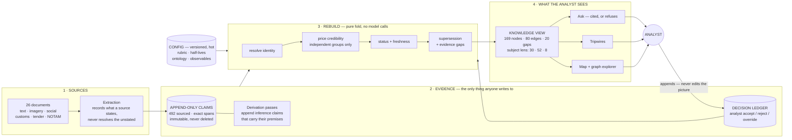

# Chanakya — an auditable OSINT order-of-battle and supply-chain map

**Design note · HQ-9/P (Pakistan) · July 2026**

## What this is

Open sources are abundant, cheap to fabricate, trivially recycled, and produced almost entirely by
parties with an interest in the answer. The scarce thing is not collection; it is warranted belief. This
system is built around that.

It assembles a fragmented open-source picture into **one auditable order-of-battle plus supply chain for
a single adversary air-defence capability** — what they have, where it is, how it is sustained, and where
the dependencies break. The subject is the Pakistani HQ-9/P long-range SAM, enriched with the Chinese HQ-9
origin chain. Open sources only, planning awareness rather than targeting-grade, and an analyst in the loop
— never finished intelligence emitted autonomously.

The build is **one reusable spine plus a thin use-case layer**. The spine — the claim model, entity
resolution, credibility, human adjudication, freshness, retrieval — is subject-agnostic and took most of
the engineering; the HQ-9/P layer is a specification on top of it. The current graph is built from **492
sourced claims extracted from 26 documents**, nine of them overhead imagery plus a schematic read out of
a PDF, yielding a knowledge view of 169 nodes, 80 edges and 20 named evidence gaps — of which the
subject lens an analyst actually works in scopes to 30 nodes, 52 edges and 8 gaps. The corpus carries
planted adversarial material rather than mere volume: a false attribution of the engagement radar to the
wrong organisation, a decoy social cluster asserting a relocation that never happened, and a byte-identical
image reshared across three accounts. Each is there to be rejected, and the worked query below rejects the
first by name. A separate bulk-chaff set exists for relevance load-testing and is not currently ingested;
nothing in this note rests on it.

## Four load-bearing ideas

**1. A bi-level graph.** The lower layer is an **append-only evidence layer**: immutable sourced claims of
the form *source S, dated D, asserts that X relates to Y*, each pinned to an exact span in an exact
document, never edited and never deleted. The upper layer is a **knowledge graph derived from it by a
pure function** — resolve entities, price credibility, assign status, recompute. Because the derived
layer is a function of the log, one-click traceability and the separation of *confirmed* from *probable*
are properties of the architecture rather than features bolted onto it: every node and edge carries the
claim identifiers that produced it, so "why does this exist" always answers with spans, not a summary. It
also makes a human decision, a retraction and a new document the same operation — append, then recompute.
Purity here is enforced, not asserted: a gate test stubs the model client to raise, blocks sockets,
freezes the clock and varies the hash seed, then requires the rebuild to run anyway and emit a
byte-identical view.

A third element carries most of the analytic work. Some facts no source states — Pakistan does not publish
its order of battle, so nothing says *this unit is based at that site*. Those come from **derivation passes
that run before the fold and write their conclusions back into the evidence layer**, as inference claims
carrying the identifiers of their premises. A derived fact is therefore demoted into evidence rather than
promoted into the picture: priced, cited and challengeable on the same terms as something a source said,
clicking back to the spans it was built from, and — because an inference shares an independence group with
its own premises — unable to corroborate itself into a stronger status. Evidence, derivations that append
to it, and a pure fold over the result: the log is the only thing anyone writes to.

**2. Credibility, not collection.** A claim's confidence is built from the reliability of its originating
source, the number of genuinely **independent** corroborating groups, integrity signals, and freshness
decay. Source reliability is **computed, not typed**: an analyst sets weights over five named factors —
authority, process, directness, track record, intrinsic plausibility — and each source class carries a
score on each. Reliability is what falls out. Satellite imagery lands near 0.86, an official statement
near 0.75, a think-tank near 0.69, an anonymous social account near 0.25, and none of those numbers is
written down anywhere as an input. An analyst who thinks process is over-weighted relative to authority
changes one weight and the whole graph reprices. That is the difference between a rubric and a lookup
table, and it is the point of the exercise.

Independence is the discriminating idea: two reshares of one photograph are one look, not two. Groups are
keyed by collection discipline, originating document and source interest, so satellite imagery plus a
separate textual report is two looks while a coordinated social cluster is one. A single look, however
plausible, does not reach *confirmed*; a deception-flagged one is capped lower still. We rejected treating
deception as a multiplier on the score: anything that multiplies can be averaged back up by enough weak
corroboration, which is exactly the outcome a deception operation is designed to produce. It caps instead
— and the separation is structural rather than rhetorical, because the deception gates live in their own
block of the configuration, apart from the multipliers, and say only *cap at probable*.

**3. Human-in-the-loop as attention triage.** One adjudication service any pipeline stage can call, not
per-stage review code. Confident judgements proceed; ambiguous or high-stakes ones queue with a readable
reason. Crucially, an analyst decision **mutates graph state** — a rejected merge stays rejected on the
next rebuild and the downstream answer changes with it. Triage is recall-biased on purpose: the default
outcome of a contested supersession is a queued candidate, not an automatic action. Attention is the
scarce resource, so the queue is grouped rather than listed: forty near-identical rows collapse into seven
decisions an analyst can actually take, without the grouping ever deciding any of them.

**4. Adaptation.** Perishable facts decay — a basing position sits on a garrison half-life of 540 days,
while a manufacturing relationship does not decay at all — and coverage gaps are first-class objects with
a next-coverage-due date, now including the unresolved-identity tail: the mentions the system cannot yet
confirm as one entity or safely hold apart, reported as their own gap rather than papered over by a guess.
This is what makes the system a monitor rather than a one-shot analysis:
judgement stays honest as sources close and as the picture ages underneath it.

## From document to claim to graph

**Ingestion is source-typed, never subject-typed**, and nothing is filtered at the door. A front company
exists precisely so its filings do not mention the system it is importing; a dual-use HS code is chosen
precisely because it looks like radar parts for anyone. Screening on "mentions the subject" at ingest
would delete the evidence the investigation exists to find, so relevance is a conclusion reached late, in
three separate places: typed at extraction, weighted by credibility at assessment, and scored for
proximity when a question is actually asked — a subject's reach is traversed per query, while the
structural properties that traversal filters on, such as whether a component is a chokepoint, are computed
once during the rebuild. Extraction
records what a source *states*, including an alias it explicitly asserts, but never resolves what it
leaves unstated: it does not quietly collapse a front company into its parent. The pipeline has to earn
its resolutions, or it is grading its own homework.

**The schema is designed; the instances are discovered.** Entity and edge types are hand-authored —
manufacturer, component supplier, variant, radar, fire unit, formation, basing site, port, import event,
and *known gap* as a first-class node; edges for *manufactures*, *supplies-component*, *variant-of*,
*imported-by*, *based-at*, *substitutable-by*, plus the resolution overlays *same-as* and *distinct-from*.
Instances come from sources; the type vocabulary comes from configuration, so a model is not in a position
to invent one — an unrecognised kind lands in the nearest declared type today, and routing it to an
analyst as a proposed extension is designed and not yet built.

We rejected discovering the ontology from the corpus, which is the fashionable choice and the one a capable
model makes easily. The reason is the non-negotiable. An evidence-requirement template says what it would
*take* to confirm an assertion of a given kind, and you cannot write that until you have decided the type
exists. A discovered schema has no stable types to hang requirements on, so a system built over one can
report what it found but not what it is missing. Discovery buys coverage; design buys the ability to name a
gap, and we were asked for the second. And because a claim knows nothing about who will ask, **a subject is a query-time lens, not a
partition** — anchor entities plus a traversal pattern over one graph, which is why a second subject is
configuration rather than a second system.

**Resolution is the analytic engine, not a cleanup step.** If relevance only emerges once the unlabelled
importer is connected to the subject, then whatever makes that connection is doing the analysis — and
string similarity cannot. Identity here is relational: designators touching the same units, sites and
suppliers are probably the same thing whatever their spelling, while two that look nearly identical may
be unrelated systems. The corpus supplies both errors in their pure form. **LY-80 and HQ-16 share not one
character, and are the same system** — an export designation and its domestic original — and the only
thing that says so is that they hang off the same manufacturer and the same component set. **FD-2000 and
FT-2000 differ by a single character, and are unrelated.** Any measure of spelling gets both of these
exactly backwards, which is why shared neighbourhood carries the weight. A curated alias, a shared hard
identifier or an exact name still seeds identity directly — the high-precision floor, veto-gated so a known
trap pair can never slip through it — but a bare name *resemblance*, with nothing relational behind it, no
longer buys a merge on its own: it enters as a *possible* link to be earned or discarded, not an asserted
identity.

**Identity is an assessment, held to the same evidentiary bar as any other.** It is not a string verdict
but an evidence-backed hypothesis carried at *possible*, *probable* or *confirmed* — and, exactly like a
claim, it reaches *confirmed* only on genuinely independent and durable support: a merge resting on a
single look, or only on a here-today signal such as a posture certain to change, is held no higher than
*probable*. The signals that move it are typed by what they *mean* for
identity rather than averaged into one similarity number. A **critical** attribute — the kind that defines
the thing, such as which service operates a unit — is a hard wall: when two mentions disagree on it, no
amount of other similarity may merge across, full stop. That wall is itself credibility-gated, so a single
low-grade source cannot shatter a well-supported identity by asserting a conflict — below a grade floor the
disagreement is routed to a human rather than enforced. A **supporting** attribute nudges the score and, on
conflict, queues rather than blocks; a **neutral** one keeps both values with their provenance and touches
identity not at all. And a fact that legitimately changes over time — a posture, a readiness state — is
read as a *succession*, not a contradiction, so a unit that has moved is not mistaken for two units.

The result still resolves to one of three actions — merge, adjudicate, keep apart — but the action now
sits under the status. The boundary is precision-first because the errors are asymmetric: a missed merge is
recoverable by iteration or a human, while a confident wrong merge corrupts the order-of-battle invisibly.
Both pairs above go in front of a person rather than being decided — and so does the subtlest case, a pair
that looks like one entity yet would fuse two clusters a wall is deliberately holding apart, which surfaces
as a flagged candidate an analyst must clear rather than an automatic bridge. Every merge is a reversible
overlay rather than a destructive collapse, so an analyst can undo the machine's identity decisions — which
is the difference between a human in the loop and a human watching.

**Retrieval separates composing an answer from judging it.** A question runs a think-act-observe loop
bounded at eight turns, in which the model plans the traversal while seven deterministic tools do the
counting, path-finding and materiality; the model never tallies chokepoints in its own head. Judging is a
separate pass with teeth: every sentence must cite a claim that exists, a sentence about a hop must cite
that hop's own claims, and **any number appearing in the prose must be a number a tool actually returned**.
When that check fails the answer is not repaired — it is withheld in full and replaced by a refusal naming
what failed. An empty result likewise routes to a reasoned evidence-gap refusal rather than a confident
negative. We rejected GraphRAG-style community summarisation, because routing answers through a generated
summary severs the line back to the exact span; we rejected single-pass vector retrieval, because it cannot
chain battery to operator to supplier and its chunk-level provenance cannot separate *says* from
*corroborates*; and we rejected free-form query generation, because it cannot distinguish "no data" from
"insufficient to assess" — the one distinction this system exists to make.

The worked query below is deliberately the exception: it runs a **fixed plan rather than a planned one**,
and needs no model key. The plan is fixed; the answer is not — every entity is resolved from the live graph
as it runs, and a step that cannot resolve short-circuits into a refusal naming what it could not bind. A
demonstration that cannot be reproduced is not evidence, and a reviewer with no credentials should still be
able to run the thread end to end.

**Where the model is used, and where it is refused.** It reads documents into claims, reads overhead
imagery, judges whether an observed shape matches a reference signature, plans free-form queries, and
checks entailment in answers. It does not price credibility, group corroboration, decay freshness, assign
status, adjudicate supersession, compute materiality, find paths, or derive basing — all deterministic code
reading a configuration file. The rule is that **the model is used where the input is unstructured and its
output is a proposal, and refused where the output is a number an assessment rests on.** The imagery schema
makes the same point structurally: it has no field for a weapon system and none for coordinates, so the
vision model is not trusted to stay subject-blind — it is given nowhere to put the answer, and can return
only a count range or an explicit abstention.

## The non-negotiable, mechanised

Where evidence is absent, ambiguous, or contradictory the system returns **"insufficient evidence to
assess"** — and names what is missing. This is not prompt discipline; it is an **evidence-requirement
template** attached to the assertion type. Confirming a sole-source supplier requires a named supplier and
a substitutability assessment; confirming a basing position requires imagery plus an independent textual
group. When the slots are unfilled the system emits a gap object naming the empty slots, an **observability
ceiling** (some facts are confirmable with more collection; some can never exceed *probable* from open
sources), and a next-coverage date.

The clearest instance sits at the analytic centre of the map. The HT-233 engagement radar is the plausible
chokepoint of the HQ-9/P — but the authoritative open-source study marks its manufacturer **unknown** and
debunks the widespread claim that CPMIEC builds it (CPMIEC is the export agent, not a manufacturer). Who
builds the *system* is evidenced and is drawn; who builds the *radar inside it* is not, and the distance
between those two edges is exactly where a system like this earns or loses its credibility. So no
manufacturing edge is drawn to the radar at all; what is recorded is a candidate with a named best guess
and an explicit gap. Recording "CASIC manufactures the HT-233" would complete the chain and close the map — and
it would be unfalsifiable to everyone downstream, because a confident edge with nothing behind it is
indistinguishable, to the analyst reading it, from one that was earned. A gap can be tasked against. A
fabricated edge is planning built on a guess nobody can see.

## The worked thread — the same question, asked twice

The query is: *trace the long-range SAM battery now based at Rahwali back to the organisation that builds
its missile system, and name the fire-control chokepoint.* It is asked twice, and the interesting thing is
what happens in between.

**Asked first, it refuses.** Two confirming documents are held out of the starting corpus, so the site the
question names does not yet exist in the graph. The system does not pick whichever Rahwali-shaped node
looks closest; it declines to begin the trace and names the exact anchor it could not bind. Nothing is
asserted about the world, because nothing was consulted.

**Then the held-back documents are ingested, live, and the tripwire fires.** Ask the identical question
again and it now traces: Rahwali to the fire unit, the unit to the HQ-9/P it fields, the variant to CASIC
as the organisation that builds it — three hops, nine citations, every hop resting on an edge that clears
the assertable band. **The answer changed because the evidence changed, and the question did not.** That
is the whole monitoring claim in one gesture, and it is the reason the refusal is worth staging rather
than engineering away: a system that answers before and after in the same voice has not demonstrated
anything.

What it still declines to say is the point of the exercise. The chain terminates on the organisation
behind the *system*; the supplier of the HT-233 engagement radar itself remains an open gap, reported as
one, with no collection tasked against it. And the corpus's planted false attribution — CPMIEC as the
radar's maker — is not silently dropped. It is printed in the answer as **weighed and not carried**, with
its status and its citation, so the analyst sees the trap the system walked past rather than having to
trust that it did.

## The relocation beat

The strongest thing in the build is a monitoring thread that no source in the corpus actually states.
**Pakistan does not publish its order of battle** — no document might say "unit X is based at site Y." So basing  
has to be *derived*, and the derivation is the interesting part.

We hold it in **two layers at separate confidences**. The first is *observed equipment at a site* — an
overhead frame shows an HQ-9B launcher and an HT-233 radar in a revetted site at Rahwali, directly seen and
priced accordingly. The second is *unit attribution* — the inference that the formation occupying that site
is the same fire unit last seen at Rawalpindi, a weaker proposition carrying its own status. Separating
them is what keeps a strong observation from lending its strength to a weak identification. The derived
fact goes into the evidence layer carrying its premises, and **inherits the sighting's real-world date**
rather than the date we processed it.

The consequence, measured on the real corpus: the 2021 Rawalpindi position decays to a freshness factor of
**0.107** and reads **stale** — history, not an evidence gap, which is a distinction the status machine now
makes explicitly. The 2025 Rahwali position reads **probable** at confidence 0.790 and freshness **0.774**,
backed by **two independent groups**: a satellite pass and a separate textual confirmation. A **supersedes
edge is drawn from Rahwali to Rawalpindi**, carrying the union of three source claims, so the relocation is
visible and traceable in the graph itself rather than buried in an internal field.

Two details carry the judgement. The tripwire **does not name its own answer**: it declares only *who* is
watched — one resolved fire unit — and *what class of change* counts, an occupancy change on a basing
edge. Neither origin, destination, nor year. A tripwire naming its destination would fire exactly once, on
the move it already encodes, and would be confirming a relocation rather than detecting one; the sites
appear only in the fired alert. And the corpus contains a planted low-grade adversary cluster asserting the
*reverse* move, that the battery has quietly left Rahwali. The tripwire stays silent on it. A change over
time is not a contradiction to be silently overwritten; it is put through a **succession test** that asks
whether two facts about one functional slot are an ordered move, a genuine contradiction, or simply
unorderable. Retiring a position is the ordered case, and it requires four things to line up — the same
functional slot, a different value, separable time intervals, and a newer claim that independently reaches
*probable* with a clean deception check. Short of that the change becomes a **candidate held for a human**,
with readable reasons attached: *newer below probable*, *deception gate: decoy risk*. One decoy-flagged look
cannot retire a two-look position. Holding is the default; retirement is earned.

## What this system cannot do

The corpus is **synthetic-from-real-template**: real specimens supply format and messiness, entities and
values are varied synthetically, and the generator is blind to the ontology, so the pipeline cannot be
accused of extracting what we planted. The customs layer is synthetic **by necessity, not convenience** —
finished SAM systems are genuinely invisible in public customs data (Russia classified its records in 2022,
China publishes aggregates, Pakistan has no feed). The confirming satellite frames are real imagery of
genuine SAM sites relabelled to scenario locations and recorded as such: a fabricated confirming image is
precisely what the integrity layer should catch, so we do not use one.

The historical rewind is **transaction time**: "as we knew it on this date", never "as it was". The
substrate for valid time now exists — claims carry their own event, report and ingest times, and the graph
surfaces value-timelines and edge validity intervals — but the rewind *surface* that would reconstruct the
world *as it was* on a past date is roadmap work, and event-date coverage is still partial enough that it
would land unevenly.

**Of the four questions this map sets out to answer, sustainment is the one it currently does not.** What
they have, where it is, and where the dependencies break are all answered on evidence; how the capability
is *sustained* — spares, resupply, maintenance, training — is declared in the ontology and carries zero
instances. Stockpiles, replenishment and technical-data authority are types with no members. The reason is
mostly in the world rather than the design: sustainment for a fielded SAM leaves very little open-source
trace, which is the same argument that makes the customs layer synthetic. But it is a gap in the deliverable
and not only in the sources, and it is stated here rather than absorbed into a claim of completeness.

Every claim currently enters at full extraction confidence. There is no channel by which an ambiguous read
of a blurred frame or a mangled scan discounts its own claim, so extraction quality is invisible to the
credibility arithmetic — the seam exists, nothing fills it. Denials are extracted and then discarded, since
nothing downstream consumes them: a system arguing for epistemic honesty currently has no representation for
*X was denied*. And the calibration constants — weights, thresholds, half-lives — are coarse, analyst-tunable
defaults, not calibrated against observed outcomes, and we do not claim otherwise. The PDF reader is
AGPL-licensed, which is fine for a hosted evaluation and would need replacing in anything distributed.

## Where it breaks at scale

The architecture's central bet — derive everything from an append-only log — is what makes provenance,
reversibility and reproducibility nearly free, and it is also the first thing to break. **The rebuild is
linear in the log.** At 492 claims a full recompute is milliseconds; past roughly a million edges it must
become incremental, and the derived view must persist rather than live in memory, which moves it behind a
property-graph store while the log-and-rebuild contract above it stays put.

**Resolution scales worse than the graph does.** Identity is recomputed from scratch on every rebuild, and
candidate generation is all-pairs within a block — tolerable at 169 nodes, quadratic pain past that. It needs
real blocking and namespacing by country and domain, because collision risk grows quietly with size: two
unrelated "Factory 404"s in one graph is a false merge waiting to happen, and false merges are the failure
mode that hides. A persistent resolution register, rather than a from-scratch pass, is the structural fix.

**Extracting every document through a model does not survive real volume.** The honest answer is not to start
deleting at the door — that reintroduces the relevance gate we argued against — but to route low-signal
documents to a cheaper lane and keep them, and to add real deterministic parsers for the high-volume
structured formats (NOTAM, bills of lading, tender skeletons) where the format is stable enough to earn one.
Relatedly, running no embeddings is right at hundreds of curated nodes, where the discriminating signal is
relational rather than semantic; at corpus scale, offline embedding-based candidate generation earns its
place for resolution recall.

Finally, the single-writer log means a **single analyst**. Multi-analyst operation needs a durable shared
store and a role model — an intelligence tool serves a team, and this one currently serves an operator.

## What we would do next

**First, close the gaps we can name.** Calibrate the credibility weights, thresholds and half-lives against
the frozen corpus and publish a reliability diagram — the whole confirmed/probable/stale machinery currently
rests on sensible but unvalidated defaults, and this is the single largest gap between "defensible" and
"validated." Populate the sustainment tier, which is declared and empty. Score extraction itself against
claim-level ground truth, so accuracy is measurable rather than inferred from downstream graph shape. Wire
per-claim extraction confidence and a negative-evidence channel, the two seams named above. Then let source
reliability **learn** — the rubric already carries a track-record factor, pinned at a neutral prior and
weighted alongside the rest, so this is filling a slot that exists rather than adding one; a source earning
or losing standing from its own confirmed-and-refuted history is the strongest possible answer to "isn't
your source tiering just hardcoded?", and the decision ledger already records the history it would consume.
Add a second frozen scenario so an evaluator can pick one live, which is the direct answer to "is this tuned
to one corpus?"

**Deeper still, encode the decision frameworks themselves.** What exists today is a *substrate* that can host
an agency's analytic tradecraft — credibility kept decomposed, inference recorded as a claim with its premises,
absence kept as evidence, observables declared as config — but not yet an encoding of the frameworks that
substrate is meant to carry. The structured techniques a real desk runs on — analysis of competing hypotheses,
a key-assumptions check, an indications-and-warning indicator battery, the analytic standards that force
confidence and sourcing to be *stated* rather than assumed — are things the system can currently *support*, not
things it *does*: the discipline still lives in the analyst's prose rather than in the tool. Making them
first-class — so an analyst invokes "run an ACH across these hypotheses" and the system carries the procedure
and enforces the standard — is what turns a well-structured graph into an analyst's instrument, and it is the
largest single depth investment left. This is a deliberate fork. It is the work to spend on if we **drill down**
past the demo and harden the system for sustained analytic use; if the nearer goal is instead a client demo in
roughly four weeks, the **breadth** moves below — widening to the adjacent problems and putting the client's own
sources on the intake — are the better use of the same time.

**Then, widen the problem.** This use case is the *anatomy* — what an adversary has and what it needs to keep
it running. Two adjacent problems complete the picture, and the order matters.

Widening is cheap here for a reason worth stating plainly, because it is easily mistaken for breadth-chasing.
C was concretely in front of us the whole way — but the system was deliberately built around a *view*: encode
the general way an analyst works, not the specifics of this one target. That generality was intended, by
design; it is not overfitted to the problem and it did not have to be retrofitted for A and B. What keeps it
from being breadth-chasing is that the view was disciplined by C at every turn — every configurable seam
answers to a real pressure C created: a credibility judgement an analyst cannot inspect and retune is not
auditable, an ontology welded into code cannot be corrected when a source proves it wrong, and a tripwire
that requires a developer is not a tripwire. So the generality is grounded in one use case done honestly, not
bolted on for imagined ones. What the view buys is that the analyst's reasoning ends up expressed as data —
weights, thresholds, requirement templates, edge lanes, watch conditions — rather than as control flow. And
once one analyst's reasoning is data, **a different analyst's reasoning is a different configuration, not a
different system.** That is what makes the next two problems tractable — a deliberate design stance,
disciplined by depth on C rather than a substitute for it.

**A — the longitudinal air-posture picture** is next: baseline each location, flag deviation from that
baseline, and separate genuine cross-area correlation from coincidence. It is the *volume* question — how much
is moving — and it falls out of the existing substrate almost directly, because events are already first-class
and every claim already carries both when-it-happened and when-we-learned-it. A baseline is an aggregation over
events; a deviation index is a query over that aggregation.

**B — anticipatory warning** is the one worth building last and the one worth the most. It asks whether observed
activity is routine exercise, coercive signalling, or genuine mobilisation, and returns a warning estimate with
most-likely and most-dangerous courses of action, explicit confidence per judgement, the indicators that would
confirm or deny each, and a marked dissenting view. **B is powerful precisely because it consumes A and C.** An
adversary running an exercise puts launchers where satellites can see them — that is A's signal, and it is
theatre. But a quiet surge of shipments from the one supplier C identified as the chokepoint is not theatre; it
is preparation. Intent is not readable from activity volume alone, and it is not readable from a supply chain
alone. It is readable from the *disagreement* between them, which is why the anatomy had to be built first.

Structurally B is configuration plus one scoring module rather than core rework, because five things were
committed early for exactly this: events as first-class objects, inference as a claim kind that carries its
premises, absence recorded as evidence rather than silence, observables as declarative config, and a credibility
score kept decomposed so *why* confidence is high stays interrogable. Competing-hypothesis scoring is inference
claims with evidence for and against; an indicator battery is configuration entries; deception resistance is the
independence machinery already carrying the relocation beat. What it would demand that does not exist yet is
genuine research, not plumbing: separating exercise from mobilisation, resisting planted and withheld signals,
and recognising when the system is being deceived rather than confidently mis-warning.

**And, for a specific client, make the intake theirs.** The steps above are analytical depth; a shorter,
orthogonal one makes the system *land*. Because ingestion is source-typed rather than use-case-typed and
already reads both free text and pre-extracted bundles, wiring a small live scraper against the feeds a given
client already works from — the NOTAM/NAVAREA services, the trade-press and customs portals, the accounts
they trust — drops their own familiar sources onto the same claim schema with nothing downstream changing:
it is a new source adapter in front of the extractor, not a new pipeline. The payoff is recognition rather
than capability — an analyst watching the system reason over the exact material they read every morning is
the difference between a clever prototype and their own workbench.

---

*Stack: append-only SQLite evidence and decision logs; an in-memory knowledge view rebuilt in-process on every
change; LLM extraction into a single claim schema, live at ingest, with a seeded baseline so the app boots
without a key; no runtime embeddings; a bounded tool-calling agent over a small set of graph tools, with a
mandatory citation validator and first-class refusal; one process serving the JSON API and the built SPA
same-origin, in one container behind a managed tunnel. No managed database and no network plumbing — that
absence is the design.*